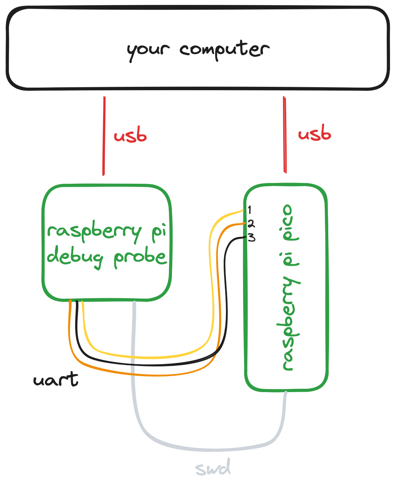

# _rpi_pico_examples.zig_

Example Zig project for the Raspberry Pi Pico microcontroller.

## Building

To build the firmware:

```
zig build
```

The firmware will be placed in `zig-out/bin`.

## Running the code

While you could upload code the USB bootloader, it's more fun to do everything
from `zig` instead!

You will need:

1. A Raspberry Pi Pico.
2. A Raspberry Pi Debug Probe _**or**_ a second Pico running [`picoprobe`]. 
3. An installation of OpenOCD.
4. An installation of the GNU ARM embedded toolchain for `arm-none-eabi-gdb`.

Connect your hardware up as follows:

<p align="center">
  <picture>
    <source media="(prefers-color-scheme: light)" srcset="./assets/rpi_pico.png">
    <source media="(prefers-color-scheme: dark)" srcset="./assets/rpi_pico_dark.png">
    
  </picture>
</p>

Then run:

```
zig build xrun
```

This will flash the firmware onto your device, then monitor for [RTT] output.
You should see:

```
hello world
```

Printed to the terminal.

[`picoprobe`]: https://github.com/raspberrypi/picoprobe
[RTT]: https://github.com/rjsberry/rtt.zig

## License

The examples in this repository and all other `rp2040.zig` code is dual licensed
under the 0BSD and MIT licenses.

The examples contain binary second stage boot code which is licensed by
Raspberry Pi (Trading) Ltd. under the terms of the 3-clause BSD license.
